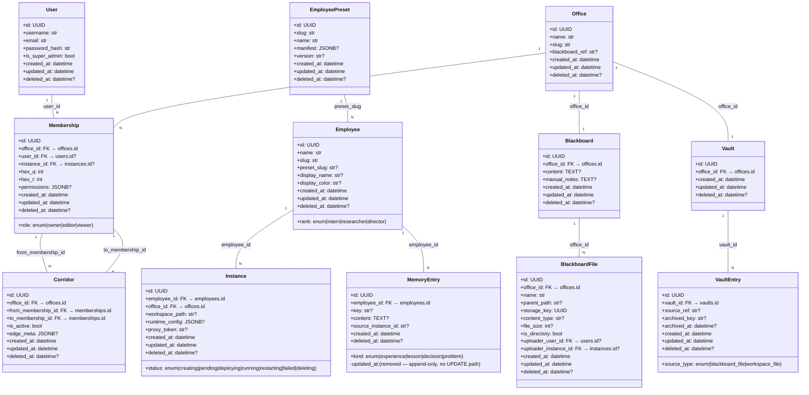

# Cocoa Domain Model

> ER diagram, cardinality table, directory contract, slash-protocol summary, forward-contract notes, and key design decisions for the Cocoa P2 core data model. Entity names follow the [metaphor name table](./metaphor-name-table.md).

## ER Diagram

## Cardinality Table

| Entity A | Cardinality | Entity B | Foreign Key / Join | Notes |
|----------|------------|----------|-------------------|-------|
| User | 1 : N | Membership | `memberships.user_id` | Exclusive-FK: user_id XOR instance_id; one user may belong to many offices |
| EmployeePreset | 1 : N | Employee | `employees.preset_slug` (soft ref) | Slug-based reference, NOT a formal FK to `employee_presets.id`; preset can be deleted or re-versioned independently |
| Employee | 1 : N | Instance | `instances.employee_id` | One employee (细胞) spawns multiple instances (分身) across offices |
| Employee | 1 : N | MemoryEntry | `memory_entries.employee_id` | Append-only log; entries are never updated |
| Office | 1 : N | Instance | `instances.office_id` | Instance is bound to exactly one office |
| Office | 1 : N | Membership | `memberships.office_id` | Users and instances join an office through a membership record |
| Office | 1 : 1 | Blackboard | `blackboards.office_id` | Partial unique on `(office_id)` where `deleted_at IS NULL` |
| Office | 1 : 1 | Vault | `vaults.office_id` | Partial unique on `(office_id)` where `deleted_at IS NULL` |
| Blackboard | 1 : N | BlackboardFile | `blackboard_files.office_id` | Files belong to the same office, keyed by `(office_id, parent_path, name)` |
| Vault | 1 : N | VaultEntry | `vault_entries.vault_id` | Each entry tracks what was archived, when, and the retrieval key |
| Membership | 1 : N | Corridor (from) | `corridors.from_membership_id` | Directed edge in the adjacency graph |
| Membership | 1 : N | Corridor (to) | `corridors.to_membership_id` | Directed edge in the adjacency graph |

### Implicit relationships (no dedicated FK, navigated via intermediate entity)

| Path | Notes |
|------|-------|
| Instance → Office | Via `instances.office_id` FK (not diagrammed as a separate edge — Instance is always owned by one Office) |
| Instance → Membership | Via `memberships.instance_id` (exclusive-FK, instance membership in an office) |
| User → Instance | No direct FK; a User acts on an Instance through Office membership |

## Entity Summary (with metaphor names)

| Table | Code Term | Bio-Name | Display Name | Description |
|-------|-----------|----------|-------------|-------------|
| `users` | User | — | — | Human authentication identity |
| `employee_presets` | EmployeePreset | — | 灵格 | Reusable preset template with manifest and version |
| `employees` | Employee | 细胞 | 细胞 | Persistent agent identity with rank and preset |
| `instances` | Instance | 分身 | 分身 | Employee runtime in a specific office |
| `offices` | Office | 菌落 | 菌落 | Collaboration workspace boundary |
| `memberships` | Membership | — | — | User or Instance presence in an Office with role + hex coords |
| `corridors` | Corridor | 突触 | 突触 | Directed adjacency edge between memberships |
| `blackboards` | Blackboard | 共生面 | 黑板 | 1:1 shared collaboration context per Office |
| `blackboard_files` | BlackboardFile | — | — | File/directory within a Blackboard |
| `vaults` | Vault | 冰封库 | 冰封库 | 1:1 cold archival storage per Office |
| `vault_entries` | VaultEntry | — | — | Archived artifact entry |
| `memory_entries` | MemoryEntry | 基因组 | 基因组 | Append-only employee memory log |

## Directory Contract Summary

At P2 scope, the system defines these content scopes (aligned with `ContentRef.scope` in the slash protocol schema):

| Scope | Target | Read/Write | Persistence |
|-------|--------|-----------|-------------|
| `workspace` | Instance filesystem (`instances.workspace_path`) | Read + Write | Tied to Instance lifecycle |
| `blackboard` | `blackboards.content` / `manual_notes` + `blackboard_files` | Read + Write (permission-gated via Membership role) | Survives Instance restarts; per-Office |
| `vault` | `vault_entries` (cold storage) | Read-only (write via `/archive` command) | Permanent archive per Office |
| `memory` | `memory_entries` (employee log) | Read + Append (no update) | Cross-Instance for the Employee |

Files within `blackboard` scope are represented as `BlackboardFile` rows with a virtual directory tree keyed by `(office_id, parent_path, name)`. The `storage_key` is a globally unique UUID referencing the underlying object store.

## Slash-Protocol Summary

The slash protocol (`app/schemas/slash.py`) defines three Pydantic models as a forward contract for P4's parser:

- **`ContentRef`** — Points to content in one of four scopes: `workspace`, `blackboard`, `vault`, or `memory`. Has a mandatory `scope` field and optional `path`.
- **`Directive`** — A single command within a Turn: `target_employee` (optional agent target), `cmd` (verb, e.g. `/read`), `args` (positional), optional `content_ref`, and `raw_text` (populated by P4 parser).
- **`Turn`** — A user utterance decomposed into a list of `Directive` objects plus `general_text` for free-form content that does not parse into any directive.
- **`CommandRegistry`** — Placeholder shape for the global command list and per-preset overrides. Final schema owned by P4.

At P2, these schemas are structural definitions only — no parsing logic exists. They are consumed by API endpoints that accept pre-parsed directive lists.

## Forward-Contract Notes

| Concern | Phase | Detail |
|---------|-------|--------|
| `EmployeePreset.manifest` (JSONB) | P3 | The `manifest` field stores preset definition data (skills, tools, model, instructions). Its internal schema will be defined in P3 when presets become active. At P2 it is nullable and untyped. |
| `CommandRegistry` | P4 | The `CommandRegistry` schema in `slash.py` is a placeholder. P4's slash-parser module will own the final command list, per-preset overrides, and command validation logic. |
| Slash protocol parser | P4 | Raw text → `Turn`/`Directive` parsing is a P4 concern. P2 only validates pre-parsed objects. |
| Corridor acyclicity | P5 | The Corridor adjacency graph currently has no cycle-detection at the DB level. A service-layer acyclicity check is planned for P5 (checking for closed loops when edges are added). |
| Ring (环) topology | P3/P4 | The Ring concept is named in the metaphor table but has no corresponding DB table. It is a higher-level grouping of Memberships for explicit collaboration rings. |

## Key Design Decisions

### 1. Soft-Delete with Partial Unique Indexes

All 12 tables use soft-delete via `BaseModel.deleted_at` (nullable `DateTime(timezone=True)`). Physical deletion (`DELETE FROM`) is never used. This means every unique constraint must be a **Partial Unique Index** filtered by `WHERE deleted_at IS NULL` — otherwise a soft-deleted record would permanently block re-creation of an equivalent active record.

Examples from the schema:

- `uq_offices_slug` — `UNIQUE (slug) WHERE deleted_at IS NULL`
- `uq_memberships_office_user` — `UNIQUE (office_id, user_id) WHERE deleted_at IS NULL AND user_id IS NOT NULL`
- `uq_blackboards_office` — `UNIQUE (office_id) WHERE deleted_at IS NULL`

The `uq_blackboard_files_storage_key` index is the exception — it applies globally (no `deleted_at` filter) because `storage_key` values must be unique even among soft-deleted files.

### 2. Exclusive-FK (XOR) Constraints

Two tables enforce that exactly one of two foreign keys is non-null:

- **`memberships`** — `user_id IS NOT NULL <> instance_id IS NOT NULL` (`ck_memberships_exclusive_fk`). A Membership represents EITHER a human user OR an agent instance, never both.
- **`blackboard_files`** — `uploader_user_id IS NOT NULL <> uploader_instance_id IS NOT NULL` (`ck_blackboard_files_exclusive_uploader`). A file uploader is EITHER a human OR an instance.

This pattern avoids nullable-column ambiguity and enforces domain semantics at the database level.

### 3. Append-Only MemoryEntry

`MemoryEntry` overrides `BaseModel.updated_at = None`, removing the column entirely. This enforces immutability: once written, a memory entry cannot be modified. Deletion is still supported via the inherited `deleted_at` field.

The `source_instance_id` column is a plain VARCHAR (no FK constraint) because the referenced Instance may have been soft-deleted before the memory entry is read. The memory entry preserves the instance identity that generated it without requiring referential integrity.

### 4. EmployeePreset via Slug (No FK)

`Employee.preset_slug` references `EmployeePreset.slug` as a plain string, not a foreign key. This decouples the preset lifecycle from employees — presets can be deleted or re-versioned without cascading to employee records. An employee with a stale `preset_slug` retains their last-known configuration at instantiation time.

### 5. Hex-Grid Positioning (Membership.hex_q / hex_r)

Memberships carry axial hex coordinates (`hex_q`, `hex_r`) for spatial layout in the office hex grid. These are plain integers with no DB-level adjacency constraints — the Corridor edges define the actual communication topology. Coordinates provide a visual arrangement independent of the logical neighbor graph.

### 6. Corridor as Directed Adjacency Edges

Each Corridor is a directed edge between two memberships in the same office. The `is_active` flag allows edges to be disabled without deletion. The partial unique index `uq_corridors_active_edge` ensures at most one active edge exists between any `(office_id, from_membership_id, to_membership_id)` pair. Acyclicity enforcement is deferred to the application layer (P5).
