# Cocoa PRD v2 — 多租户架构与 Agent 栈重构

> **Status**: 决策完成 (decision-complete) — **active product target** for next implementation wave
> **基线**: 2026-07-29 diary 三张图 + PRD-v1 模板 + 9 份 evidence 文件
> **对比基线**: `docs/prd-v1.md` — PRD-v1 单租户 MVP（P15f 已落地）；PRD-v2 多租户架构
> **命名权威**: `docs/terminology.md` + `docs/metaphor-name-table.md`
> **Roadmap / blueprint**: `docs/roadmap.md` — 执行计划待 Plan 模式编写；完成后必须部署 orbstack 供人工测试
> **Append（世界 Provider）**: [`docs/prd-v2-append-provider.md`](prd-v2-append-provider.md) — models.dev 全量预设 + 可持久化自定义端点 + 眷族下拉绑定；**覆盖并细化 §16 / §14 Provider 字段**

---

## TL;DR

**你会得到什么**：一个从零开始按本体论设计的 Agent 控制台。11 个可复用 AI 角色模板（神职），真人用户按需召唤角色、注入业务知识、在 Workspace 拓扑画布上调度多个 AI 化身并行工作。AI 的每一次运行经验（Memory）会自动积累到"眷族"的身份记录里，真人通过"晋升"和"炼化"把经验提炼为可跨 Workspace 复用的能力和新角色。

**为什么这样做**：传统的聊天 Agent 每次对话都是新的——没有记忆、没有可观测状态、不能多人协作。Cocoa 用三层抽象解决这个问题：神职定义"是什么角色"（战略家还是执行者），眷族承载"面向什么场景"（内容营销还是代码审查），化身负责"在具体业务里干活"（写科技公众号文章还是修 API bug）。三者收敛到一起，AI 的经验才会积累，而不像现有工具一样每次关掉就归零。

**不会去做的事情**：不是通用聊天助手。不是无代码平台。不带语音网关。不做 RAG/向量检索知识库（至少这版不做）。单租户部署模式下只有一个 Organization，多租户是远期架构储备，当前所有数据都在同一个 Organization 内。

**工期与风险**：核心后端数据模型 18 张表 + 2 张 N:N 关联 + 4 个概念实体，Portal 前端 10 个页面 + VSCode IDE 布局。最大风险是 ai_genes 的 manifest 统一了 nodeskclaw 的 4 类基因形态，这个简化假设如果遇到"必须区分 4 类基因"的需求，需要回头重构。另一个风险是 BaseClass 的"业务无关"假设——如果用户发现所有神职需要内置业务 Prompt 片段，Entity.system_prompt 的 NULL-继承 模式可以兜底，但可能不够优雅。

**关键决策 sanity-check**：① ai_genes 不按 kind 分表——统一 manifest，workflow-gene 砍掉（编排归 Harness/Boulder）② Entity 的 system_prompt NULL 时分叉到 BaseClass 继承——一个叠加模式，避免了"每创建一个眷族都得复制 Prompt"的麻烦 ③ 能力生命周期拆成两条独立线——Memory→Gene（内容线）和 Instance→BaseClass（身份线），纠正了 PRD-v1"四级跳"把两条线揉在一起的误解 ④ pi runtime 兼容：Boulder loop engine 基于 oh-my-openagent pi runtime，config_override 遵循 AgentOverrideConfigSchema overlay 模式。

---

## §1 产品概述

### 定位

**多 Agent 控制台** — 多租户控制面：真人在 Organization 内召唤、观察、调度 AI 智能体。每个 Organization 是一套独立的租户隔离边界，内部按 Namespace（场景分区）→ Workspace（具体协作空间）级联展开。

> **核心身份区分**：Cocoa 中只有**真人用户**（User，觉醒者）能注册登录。所有"神职"（BaseClass）、"眷族"（Entity）、"化身"（Instance）都是 **AI 智能体**，由真人召唤、配置、调度，不与真人平级。真人永远是觉醒者；AI 永远是浅识者或深潜者——两类身份不互通。

### 与 PRD-v1 的核心差异

| 维度 | PRD-v1（单租户 MVP） | PRD-v2（多租户架构） |
|---|---|---|
| 顶层 | Organization（1 行） | **System**（逻辑控制面）+ Organization（N 行） |
| Entity 归属 | per-Workspace | **per-Namespace** |
| BaseClass 归属 | Organization 内共享 | **System 控制**，跨所有 Org 的全局神职池 |
| 场景隔离 | 无（单 Workspace） | Namespace 提供**场景分区**（如 coding / social-media）；Workspace 承载场景内具体工作流 |
| ai_genes 设计 | 4 类基因形态（kind enum） | **统一 schema**（无 kind enum，无 workflow-gene） |
| 用户基因 | `human_genes` 表 | **`user_genes`** 表（对齐 users 表） |

### System — 逻辑控制面

> **System 不是一张数据库表。** 它是一个逻辑概念——跨 Organization 的平台管控平面——通过以下机制体现：
> - `BaseClass` 表没有 `org_id` 列 → 所有 Organization 共享同一神职池
> - `User` 表没有 `org_id` 列 → 用户存在于 System 层级
> - `User.is_super_admin` 标志 → 平台级管理员绕过权限检查

将 System 做成表会是反模式：一个永远只有 1 行的 singleton 表。

### 租户层级

```
System（逻辑控制面，非 DB 表）
  └── Organization（世界）— 1:N，第一个 DB tenant 表
        └── Namespace（次元）— 1:N，场景分区（非 env）
              └── Workspace（空间）— 1:N，场景内的具体协作容器
```

| 层级 | 后端名 | 前端显示 | 说明 |
|---|---|---|---|
| System | `system` | —（逻辑层，不显示） | 管控 BaseClass 池 + User 注册。无 DB row |
| Organization | `Organization` | 世界 | 租户隔离边界。slug="default" 为单租户兼容 |
| Namespace | `Namespace` | 次元 | **场景分区**（不是 dev/staging/prod）。Entity 属于 Namespace |
| Workspace | `Workspace` | 空间 | 场景内的具体工作流容器。Instance / Membership / CentralHub / Vault 绑定 Workspace |

**Namespace ≠ 环境分区。** Namespace 按**业务场景**切分——例如 `coding` 与 `social-media` 是两个次元。同一场景下可以有多个 Workspace（例如 social-media 下「公众号发布」「小红书运营」；coding 下「Cocoa API」「Portal 前端」）。这正是 **Entity 绑定 Namespace** 的原因：眷族身份与场景经验跨该场景内多个 Workspace 复用，而不是跟着某一个具体工作流走。

```
Organization "default"
  ├── Namespace "coding"              ← 场景：写代码 / 工程
  │     ├── Entity: 暗行-backend、衡判-qa …   (per-Namespace)
  │     ├── Workspace "cocoa-api"            (具体系统)
  │     └── Workspace "portal-ui"            (具体系统)
  └── Namespace "social-media"        ← 场景：社媒内容
        ├── Entity: 密士-content、百瞳-media …
        ├── Workspace "wechat-official"      (具体平台)
        └── Workspace "xiaohongshu"          (具体平台)
```

**单租户默认**：1 Organization → 1 Namespace → 1 Workspace，空启动，所有真人共享。可按需再开 Namespace / Workspace。

### 三层业务递进

| 层 | 模型 | 角色 | 业务绑定 | 示例 |
|---|---|---|---|---|
| **L1** | BaseClass | 无关业务 | 无 | 密士 = "战略规划者" — 什么都能规划 |
| **L2** | Entity | 面向场景 | 通过 system_prompt | 密士 + "你是一个内容营销策略师" |
| **L3** | Instance | 面向具体业务 | 通过 runtime_config.knowledge | 密士在 Workspace 里写科技公众号文章 |

### 与传统 chat 工具的核心差异

| 维度 | 传统 chat | Cocoa |
|---|---|---|
| 化身存在 | 一次性回复，关闭即结束 | 持续 loop + Memory + 共享主脑，不结束 |
| 状态可见 | 看不见化身内部 | 化身 LoopState.loop_status 通过 glow 颜色实时反映 |
| 多人协作 | 一对一对话 | 多个真人 + 多个 AI 化身共享 Workspace |
| 记忆 | 仅当前会话上下文 | AI 跨化身追加 Memory（晋升 / 炼化复用） |
| 拓扑 | 平面会话列表 | SVG 心灵图景，节点 + 通道 + 3 模式 |

### 关键技术约束

- 神职 slug 是 DB 唯一标识；UI label 走 i18n JSON
- AI 化身只有一个来源：先创建眷族（Entity），再 spawn 化身（Instance）
- Entity 属于 Namespace（not Workspace）；Instance 属于 Workspace（作为 Entity 的衍生）
- 蒸馏 4 动作：回收 (reap) / 组合 (compose) / 晋升 (promote) / 炼化 (transmute)
- 拓扑无 CorridorNode 概念 —— 任意两点直连
- Entity.config_override 遵循 oh-my-openagent AgentOverrideConfigSchema overlay 模式

---

## §2 三层正交概念：职阶 / 能力 / 知识

> **关键约束**：三个概念**完全正交**：
> - **职阶（Lab Ranks）** — 每个生物有且仅有的 1 个分类，互斥
> - **能力系统（Capabilities）** — "能做什么"，双侧各一套
> - **知识系统（Knowledge）** — 仅对 Instance 有效，与职阶/能力完全独立

### §2.1 职阶体系 — 互斥

每个生物（真人/AI）**有且只有 1 个职阶**，互斥分类，不可切换：

| 职阶 | 后端值 | 范畴 | 含义 | 存储位置 |
|---|---|---|---|---|
| **觉醒者** | `director` | 真人 User | 真人操作员。仅适用于真人用户 | 概念属性（所有 User 都是 director） |
| **深潜者** | `researcher` | AI Instance | 持久化形态 + Memory 跨化身复用 | `Entity.rank`（创建时冻结） |
| **浅识者** | `intern` | AI Instance | 无状态形态，无 Memory，每次新启动 | `Entity.rank`（同上） |

**互斥性约束**：
- 真人 User 永远 = 觉醒者。user_genes 表没有 rank 列
- Entity 职阶创建时冻结，不可改。蒸馏不改 rank
- AI 与真人不互通：不能把觉醒者分配给 AI

### §2.2 能力系统 — 双侧各自一套

| 维度 | AI 智能体侧 | 真人侧 |
|---|---|---|
| 能力原子 | `Capability` 条目（type: skill/tool/mcp/lsp） | 权限位（`can_*` 字符串） |
| 打包机制 | **深海基因（ai_genes）** — 统一 manifest JSONB | **觉醒基因（user_genes）** — 权限组 |
| 存储 | `ai_genes` 表（**无 kind 列**） | `user_genes` 表（slug + kind + permission_keys） |
| N:N 关联 | `base_class_ai_genes` | `user_user_genes` |
| 变更成本 | **高**（需 spawn 新 Instance） | **低**（立即生效） |

#### Cocoa vs nodeskclaw：基因系统设计对比

Cocoa 刻意丢弃 nodeskclaw 的 4 类基因形态。原则：**基因回答"能做什么"，编排回答"怎么做"，两者正交**。

| nodeskclaw | Cocoa 处理 |
|---|---|
| `tool-gene`（工具基因） | 保留，统一 manifest |
| `meta-gene`（元基因） | 保留，统一 manifest（所有基因本质是 meta-gene） |
| `genome`（基因组） | 丢弃——`manifest.gene_refs[]` 表达引用即可 |
| `workflow-gene`（工作流基因） | **刻意砍掉**——编排归 Harness/Boulder |

#### ai_genes 统一 Manifest Shape

```json
{
  "model": "gpt-4o-mini",
  "system_prompt": "...",
  "skills": [{"name": "code-review", "content": "..."}],
  "tools": ["shell", "group:fs"],
  "commands": ["/search", "/analyze"],
  "scripts": {"validate.py": "..."},
  "runtime_config": {"PROXY_URL": "..."},
  "gene_refs": ["other-gene-slug"],
  "mcp_servers": [{"name": "github", "command": "npx", "args": ["..."]}],
  "lsp_servers": [{"name": "typescript", "command": "...", "args": ["--stdio"]}]
}
```

**没有 kind 列**。所有字段可选。genome 的"打包"语义通过 `gene_refs[]` 表达。

#### 3 层市场模型

| 层 | 名称 | 存储 | 粒度 | 创建路径 |
|---|---|---|---|---|
| **L1** | CapabilityMarket | 概念视图 | 1 个 Capability 原子 | 回收（reap） |
| **L2** | ai_genes | `ai_genes` 表 | N 个 Capability 打包 | 组合（compose） |
| **L3** | BaseClass | `base_classes` 表 | 完整角色模板 + 基因 | 炼化（transmute） |

#### 觉醒基因（user_genes）

命名打包的 `can_*` 权限位列表。4 个内置预设：

| 预设 | 用途 |
|---|---|
| `operator-gene` | 日常 Workspace 操作（默认） |
| `auditor-gene` | 审计模式，查看所有 Workspace |
| `admin-gene` | 平台管理（首位注册用户自动获得） |
| `viewer-gene` | 只读访问（P16d） |

### §2.3 知识系统（Knowledge）— 仅 Instance 有效

> **Knowledge 不是独立的数据库表。** 它是 Instance.runtime_config 中的一个逻辑分区。

存储方式：嵌入 `Instance.runtime_config` JSONB：
```json
{
  "knowledge": {
    "env": {"KNOWLEDGE_DOCS_PATH": "/workspace/docs"},
    "files": [{"name": "api-spec.md", "path": "/workspace/knowledge/api-spec.md"}]
  }
}
```

范围：**仅 Instance**。Entity / BaseClass / User / Membership 不需要 Knowledge。

---

## §3 命名对照表

### 3.1 租户层级

| Backend | Frontend | 说明 |
|---|---|---|
| `System` | —（逻辑控制面） | 非 DB 表。管控 BaseClass 池 + User 注册 |
| `Organization` | 世界 | 租户隔离边界 |
| `Namespace` | 次元 | 场景分区（非 env；Entity 归属层） |
| `Workspace` | 空间 | 协作空间 |

### 3.2 Backend → Frontend 核心映射

| Backend | Frontend | 用途 |
|---|---|---|
| `BaseClass` | 神职 | 预设模板（System 控制，跨 Org 共享） |
| `Entity` | 眷族 | per-Namespace AI 身份 |
| `Instance` | 化身 | 运行时 pod |
| `Membership` | 契印 | Workspace 成员关系 |
| `Passage` | 通道 | 拓扑边（CorridorNode 已 drop） |
| `CentralHub` | 主脑 | 协作中枢（4 脑区合成） |
| `Vault` | 冰封库 | 冷存储档案 |
| `Memory` | 记忆沉淀 | 追加日志（append-only，无 updated_at） |
| `LoopState` | 心智状态 | Harness 运行时状态 |
| `DeployRecord` | 降世记录 | K8s 部署流水线记录 |

### 3.3 11 神职表

| Slug | Display | 职能 | 命令面 |
|---|---|---|---|
| `mi-shi` | 密士 | 战略规划 | /plan /decompose /prioritize |
| `huan-ling` | 唤灵 | 意图分析 | /analyze /clarify /propose |
| `an-xing` | 暗行 | 单兵全栈 | /plan /execute /build /test |
| `an-ying` | 暗影 | Junior 快速 | /execute /build /test |
| `zhu-jin` | 铸金 | 目标驱动 | /execute /build /test |
| `ling-shi` | 灵视 | 只读架构 | /analyze /predict /review |
| `heng-pan` | 衡判 | 质量门禁 | /review /approve /reject |
| `you-hun` | 游魂 | 仓内探索 | /search /survey /report |
| `qian-zhi` | 潜知 | 外部调研 | /search /reference /survey |
| `bai-tong` | 百瞳 | 视觉媒体 | /look /analyze /describe |
| `jiu-ri` | 旧日 | 顶层委派 | /delegate /monitor /approve |

### 3.4 PRD-v2 新增字段

| 表 | 字段 | 类型 | 含义 |
|---|---|---|---|
| `Entity` | `namespace_id` | FK → namespaces.id | Entity 归属 Namespace |
| `Entity` | `system_prompt` | TEXT NULLABLE | NULL = 继承 BaseClass，非 NULL = Entity 级覆盖 |
| `Entity` | `config_override` | JSONB NULLABLE | AgentOverrideConfigSchema overlay |
| `Namespace` | `description` | TEXT NULLABLE | 场景描述 |
| `Namespace` | `tags` | JSONB NULLABLE | 场景标签（不做 preset enum） |
| `Workspace` | `namespace_id` | FK → namespaces.id | Workspace 归属 Namespace |

### 3.5 蒸馏动作术语

| 动作 | 中文 | 含义 |
|---|---|---|
| `reap` | 回收 | Memory → Capability，写入能力市场 |
| `compose` | 组合 | Capability → ai_gene，打包成深海基因 |
| `promote` | 晋升 | Instance → Entity 增强，Entity 内部共享 |
| `transmute` | 炼化 | Entity → 新 BaseClass，跨 Workspace 复用 |

### 3.6 概念实体

| 名称 | 类型 | 含义 |
|---|---|---|
| `System` | 逻辑控制面（非 DB 表） | BaseClass 无 org_id + User 无 org_id |
| `Knowledge` | 概念设施（嵌入 Instance.runtime_config） | env + file 注入容器，无独立表 |
| `CapabilityMarket` | 概念构造（查询/视图） | 聚合 ai_genes + BaseClass.manifest 的能力市场 |

---

## §4 BaseClass (神职) — 业务无关角色模板

### 4.1 核心定义

**BaseClass 是业务无关的——它定义"什么角色"（执行者/审查者/探索者），不定义"什么场景"。**

BaseClass 由 **System 逻辑层**控制，是**跨 Organization 全局池**。所有 Organization 共享同一神职集合。`base_classes` 表没有 `org_id` 列——这个缺失本身就是设计意图。

### 4.2 与 Entity、Instance 的关系

```
BaseClass               Entity                  Instance
Role archetype          Scenario identity       Concrete runtime
(business-AGNOSTIC)     (scenario-SPECIFIC)     (business-CONCRETE)

"密士 = 战略规划者"      "密士 for 内容营销"     "密士 writing 科技公众号文章"
"暗行 = 全栈开发者"      "暗行 for 后端架构"     "暗行 building Cocoa's API"
```

### 4.3 关键字段

| Field | Type | Purpose |
|---|---|---|
| `slug` | VARCHAR(255) UNIQUE | Entity 通过 `preset_slug` 软引用（非 FK） |
| `manifest` | JSONB | 完整 agent 模板：prompt（通用）、model、commands、tools、skills、provider_config |
| `version` | VARCHAR(50) | Schema 版本 |

**关键约束**：`manifest.system_prompt` 是**通用模板**——描述 agent 的思维模式，不描述业务领域。Entity 的 `system_prompt` 在运行时叠加领域知识。

---

## §5 Entity (眷族) — 面向场景的 Agent 身份

### 5.1 核心定义

**Entity 面向场景——它定义 Agent 在"什么场景"工作。** Entity 属于 Namespace（per-Namespace），不是 per-Workspace。

### 5.2 PRD-v2 新增字段

| Field | Type | Purpose |
|---|---|---|
| `namespace_id` | FK → namespaces.id | Entity 归属 Namespace |
| `system_prompt` | TEXT NULLABLE | NULL = 继承 BaseClass.manifest.system_prompt；非 NULL = Entity 级覆盖 |
| `config_override` | JSONB NULLABLE | oh-my-openagent overlay。覆盖 BaseClass.manifest 特定字段 |

### 5.3 system_prompt 继承模式

```
Entity.system_prompt = NULL → Agent 使用 BaseClass.manifest.system_prompt 原样
Entity.system_prompt = "自定义内容" → 叠加在 BaseClass 默认 prompt 之上
```

### 5.4 config_override 叠加模式

遵循 oh-my-openagent AgentOverrideConfigSchema。字段不存在的回退到 BaseClass 默认值（浅合并）。可覆盖：model、temperature、commands、tools、skills、mode、permission。

### 5.5 关键约束

- `preset_slug` 是软引用（字符串），非 FK。BaseClass 可独立删除
- `rank` 创建后冻结不可改
- `namespace_id` 绑定 Entity 到恰好一个 Namespace
- `migration_hash` = SHA-256（capabilities + prompt），bump on promote / gene change

### 5.6 Instance — 保留不变

Instance 是三层递进的**业务具体化层**。无需 PRD-v2 新字段。`runtime_config` JSONB 包含 knowledge（env+file 注入），`InstanceProviderConfig` 控制 LLM provider，`workspace_id` FK 绑定 Workspace。

---

## §6 能力生命周期 — 两条正交线

> **PRD-v2 澄清**：PRD-v1 §13.6 将能力生命周期描述为单条"Memory → Capability → Gene → BaseClass"链。这混淆了两个正交维度。PRD-v2 拆为两条独立线，在 Entity 收敛。

### 6.1 两条线一览

| 线 | 名称 | 路径 | 动作 | 本质 |
|---|---|---|---|---|
| **A（记忆线）** | Content | Memory → Capability → ai_gene | reap, compose | 原始经验 → 结构化能力 → 可复用打包 |
| **B（化身线）** | Identity | Instance → Entity → BaseClass | promote, transmute | 临时运行时 → 持久身份 → 跨 Workspace 模板 |

### 6.2 动作边界矩阵

| 动作 | 链 | 写哪里 | 不写哪里 | hash bump |
|---|---|---|---|---|
| **reap** | A | Instance private + CapabilityMarket | Entity | No |
| **compose** | A | ai_genes（new insert） | Entity | No |
| **promote** | B | Entity.capabilities + migration_hash | CapabilityMarket | Yes（Entity） |
| **transmute** | B | base_classes（new insert） | 源 Entity 不变 | No（新记录） |

**关键规则**：
- "晋升不写市场" — promote 是 Entity 内部共享，不发布到 CapabilityMarket
- "炼化不写 Entity" — transmute 创建新 BaseClass，源 Entity 完全不变
- "炼化不含 Memory" — BaseClass 是模板，不含运行时记忆日志

---

## §7 基因系统 — user_genes + ai_genes 双表设计

### 7.1 双表理据

两张表结构完全不同，硬塞一张表会污染 schema：

| 维度 | user_genes（觉醒基因） | ai_genes（深海基因） |
|---|---|---|
| 主体 | 真人用户 | AI agent |
| 结构 | FK + permission_keys 列表（~100 bytes） | 完整 manifest JSONB（KB 级别） |
| 变更成本 | 低（立即生效） | 高（需 spawn 新 Instance） |
| Schema | 极简，无 manifest | 多字段嵌套 manifest |

### 7.2 user_genes — 觉醒基因

| Field | Type | Purpose |
|---|---|---|
| `slug` | VARCHAR(255) UNIQUE | e.g. "operator-gene" |
| `kind` | VARCHAR(20) enum | builtin / custom |
| `permission_keys` | JSONB | `can_*` 字符串列表 |

4 个内置预设不可删除，可复制后修改。用户有效权限 = union(所有 user_genes.permission_keys) + is_super_admin bypass。

### 7.3 ai_genes — 深海基因（统一 schema）

**没有 kind 列。没有 gene_slugs 列。** 一个 manifest JSONB，所有字段可选。

N:N 与 BaseClass 关联（`base_class_ai_genes`）。Entity 继承 BaseClass 的 ai_genes 列表，可额外添加。安装是高成本操作——修改 ai_genes 不影响已运行的 Instance。

---

## §8 协作设施

Workspace 是协作面。6 个设施提供交互底质：

### 8.1 设施架构总览

| 设施 | 作用域 | DB 表？ | 基数 | 核心特征 |
|---|---|---|---|---|
| **CentralHub（主脑）** | per-Workspace | Yes | 1:1 | 4 脑区子表，系统生成 content + 人工 manual_notes |
| **Vault（冰封库）** | per-Workspace | Yes | 1:1 + 1:N VaultEntry | /archive 命令写入，冷存储不可变 |
| **Membership（契印）** | per-Workspace | Yes | N | exclusive-FK（user XOR instance），posx/posy 视觉坐标 |
| **Passage（通道）** | per-Workspace | Yes | N | 有向边，任意两点直连，CorridorNode 已 drop |
| **Memory（记忆沉淀）** | per-Entity | Yes | N | append-only，无 updated_at，source_instance_id 非 FK |
| **Knowledge（知识）** | per-Instance | **No** — 概念设施 | 1:1 | env+file in Instance.runtime_config，与 Instance 同生共死 |

### 8.2 CentralHub — 主脑

CentralHub 是 Workspace 的 **被动共享状态容器**（非消息队列或事件总线）。消息走 Passage，事件流走 Event 审计日志。CentralHub 持有团队"共识"——文件、任务、调度，并**内置一个中央智能体（小脑 / CerebellumAgent）**。

**四脑区**（每个 Workspace 1 个 CentralHub，4 个脑区子表）：

| 脑区 | 中文 | 神经隐喻 | 子表 | 基数 | 管理内容 |
|---|---|---|---|---|---|
| Fornix | 穹窿 | 脑的弓形记忆结构——拱形通道存放记忆 | `fornix_files` | 1:N | 虚拟文件系统：文件/目录 |
| Frontal Lobe | 额叶 | 脑的执行功能中心——计划、决策、任务组织 | `frontal_lobe_kanbans` | 1:N | Kanban：todo / in_progress / done |
| Brainstem | 脑干 | 脑的自主调节器——无意识按计划运行 | `brainstem_schedules` | 1:N | Cron / interval / delay 定时任务 |
| Cerebellum | 小脑 | 脑的技能与协调中心 | `cerebellum_agents` | **1:1** | **内置中央智能体**（见下） |

#### 8.2.1 CerebellumAgent — 内置中央智能体（强制存在）

每个 CentralHub **恰好 1 个** CerebellumAgent。它不是普通眷族 / 化身：

| 维度 | 普通 Entity / Instance | CerebellumAgent（小脑） |
|---|---|---|
| 创建 | 真人召唤 | Workspace/CentralHub 初始化时**系统自动创建** |
| 软删 | 可以 | **不可**（系统级，强制存在） |
| BaseClass | 11 神职之一 | 内置 `cerebellum-baseclass`（系统专属） |
| 拓扑 | 出现在心灵图景 | **不出现在拓扑**；仅主脑视图可见 |
| 派活 | Composer / Passage | 系统自动：感知聚合、脑区巡检、脑干调度默认执行人 |
| 与 Instance 关系 | 有独立 pod / LoopState | 可有自己的运行态字段（loop_status / heartbeat）；**不是** Membership 节点 |

核心职责：感知聚合（穹窿+额叶+脑干）→ Workspace 级视图；健康巡检与预警；脑干调度的默认执行者；跨脑区一致性检查。默认 idle，按需唤醒（调度到达 / 文件变更 / todo 创建），超时回 idle。

> ER 必须显式画出 `CentralHub 1 —— 1 CerebellumAgent`。附录 A 已包含四脑区子表。

### 8.3 Vault — 冰封库

Workspace 的冷存储档案。与 CentralHub（活跃协作状态）互补——Vault 持有**已归档**内容。`/archive` 命令写入。

**存储策略（PRD-v2 范围）**：

| 层 | v2 做法 | 远期 |
|---|---|---|
| **DB 表** | `vaults`（1:1 Workspace）+ `vault_entries`（KV 元数据 + 可选 inline value） | 表结构保留 |
| **对象载荷** | v2 **允许整段 content 落在 DB KV**（`value` TEXT/JSONB 或小 blob），不强制外置 | 外置 **MinIO / S3**；DB 只留 `storage_key` / `content_hash` / MIME / size |
| **不可变** | 约定不可变（非 DB 强制） | 同左 |

每条目通过 `VaultEntry` 追踪来源：`source_type`（fornix_file / workspace_file）+ `source_ref` + `archived_key`（未来对接对象存储的 opaque key；v2 可与 inline KV 并存）。父表 `vaults` 提供 FK 完整性。

> **PRD-v2 不展开** MinIO/S3 适配器、bucket 策略、预签名 URL——记入 roadmap 远期（原 P16l 一类）。实现 wave 以 DB KV 可跑通归档闭环即可。

### 8.4 Membership — 契印

**Exclusive-FK 设计**：一个契印代表**要么一个真人用户，要么一个 AI 实例**——永不两者皆非。CHECK 约束：
```sql
CHECK ((user_id IS NOT NULL AND instance_id IS NULL)
    OR (user_id IS NULL AND instance_id IS NOT NULL))
```

选择 XOR 而非多态 FK 的原因：人机是不同的实体类型，有不同的生命周期、权限和行为。XOR 保留双方 FK 完整性。

**空间坐标** (posx, posy)：自由笛卡尔坐标，用于拓扑画布视觉布局。`uq_memberships_workspace_pos` 确保同 Workspace 无两个活跃成员占据同一位置。移动拖拽 → PATCH posx/posy。

**角色**：owner（完全控制）/ editor（可 spawn、建 Passage、写 CentralHub）/ viewer（只读）。permissions JSONB 提供细粒度覆盖。

### 8.5 Passage — 通道

**15d 简化**：CorridorNode（走廊节点）已 drop。Passage 直连任意两个 Membership——M↔M。`from_corridor_node_id` / `to_corridor_node_id` 列保留向后兼容，新代码仅创建 Membership-to-Membership 边。

**边属性**：有向（双向需两条 Passage），is_active 软开关，edge_meta JSONB（可选权重/类型/标签）。应用层 BFS 强制无环。唯一约束保证 (workspace_id, from, to) 无重复活跃边。

### 8.6 Memory — 记忆沉淀

**Append-only，无 updated_at 列**——记录创建后永不修改。跨所有同 Entity 的 Instance 累积。`source_instance_id` 为普通 VARCHAR（非 FK）——生成 Instance 可能已被软删除，Memory 必须存活。

**4 种 MemoryKind**（必需枚举，非 tag）：

| Kind | 含义 | 示例 |
|---|---|---|
| `experience` | 原始观察——"我看到 X 发生" | "用户要求修复 auth 中间件的空指针 bug" |
| `lesson` | 推断——"我从 X 学到了 Y" | "中间件空指针通常由缺失请求上下文初始化引起" |
| `decision` | 行动——"我选择了 Z" | "决定在 get_user_from_token() 调用 decode() 前加守卫子句" |
| `problem` | 未解决问题——"我做不到 W" | "无法在 staging 复现空指针——怀疑仅生产环境出现的竞态" |

Memory 是能力生命周期的原料：Memory → (reap) → Capability → (compose) → ai_gene；Memory → (promote) → Entity 增强；Memory → (transmute) → 新 BaseClass。

### 8.7 Knowledge — 概念设施

**Knowledge 不是独立的数据库表。** 它嵌入 `Instance.runtime_config` JSONB 的两个分区：
```json
{"knowledge": {"env": {"KNOWLEDGE_DOCS_PATH": "/workspace/docs"},
               "files": [{"name": "api-spec.md", "path": "/workspace/knowledge/api-spec.md"}]}}
```

**Knowledge vs Memory**：

| 维度 | Memory | Knowledge |
|---|---|---|
| **是什么** | Agent 积累的经验——它观察到的事实、学到的教训 | 领域上下文——人注入的参考文档、schema、规则 |
| **谁创建** | AI Instance（自动追加） | 真人用户（通过 deploy 配置） |
| **作用域** | per-Entity（跨 Instance 共享） | per-Instance（跟部署走） |
| **生命周期** | 跨 Instance 累积，Instance 删除后仍存在 | 与 Instance 同生共死 |
| **存储** | DB 表（`memories`） | JSONB（`instances.runtime_config`） |
| **可变性** | Append-only，不可变 | 可在部署间变化 |

---

## §9 运行时基础设施

本节描述的 Boulder loop engine 兼容 oh-my-openagent pi runtime。Entity 的 system_prompt 和 config_override 通过 AgentOverrideConfigSchema overlay 序列化为 AgentConfig 格式，由 pi runtime 驱动 Agent 实例。

### 9.1 LoopState — 心智状态

1:1 per-Instance Harness 运行时状态。与 Instance.status 跟踪正交关注点。4 熔断器：续命次数上限（50）、挂钟时间（3600s）、Token 预算（100000）、空闲超时（300s）。

### 9.2 Glow 映射

| loop_status | 颜色 | 强度 |
|---|---|---|
| running | #10b981 (绿) | strong |
| idle | #eab308 (黄) | medium |
| paused | #94a3b8 (灰) | weak |
| interrupted | #ef4444 (红) | medium |
| completed | #3b82f6 (蓝) | low |
| failed | #dc2626 (红) | strong |

### 9.3 DeployRecord — 9 步 K8s 部署流水线

resource_build → image_build → image_push → configmap_create → secret_create → pvc_create → deployment_create → service_create → health_check

### 9.4 InstanceProviderConfig

LLM provider 配置。一个 Instance 可有多个 provider config（一个 per provider_type）。api_key_ref 存引用（如 "secret/aws-bedrock-key"），非原始密钥。

---

## §10 页面导航流程图

**登录默认落点 = `/namespaces`**（而非 `/workspaces/:id`）。v2 多租户下 namespace 是顶层容器。

```
/login → /namespaces (登录默认落点，6 tab，AppShell: Sidebar+Canvas，无 Composer)
         ├── tab=workspace (默认) — Workspace 卡片 grid + 召唤 CTA
         ├── tab=base-classes — 神职市场 11 神职卡片
         │     ├── 单击→浮窗详情 / 双击→/base-classes/:slug
         │     └── "基于此召唤眷族"→Onboarding Modal
         ├── tab=contracts — 全局 User 权限管理表格
         ├── tab=entities — 全局 Entity 配置表格 + 详情浮窗
         ├── tab=capability-market — 原子能力卡片 grid + 类型过滤
         └── tab=debug — 印痕流 + 过滤 (namespace 级)

/base-classes/:slug (全屏详情 4 tab: 概览/命令/派生眷族/记忆聚合)
  └── CTA "基于此召唤眷族" → Onboarding Modal (Step 1 预选)

/workspaces/:id (VSCode IDE 布局: Sidebar + Canvas + Composer + StatusBar)
  ├── 主画布 4 tab: 拓扑(默认) / 契印 / 化身 / 记忆
  │     └── 节点交互: 单击→浮窗(920×640px) / 双击→持久化 tab
  ├── Composer 右侧面板 (常驻 360px，可拖缩 100-800px，可全屏 Cmd+Shift+F)
  ├── Sidebar 左侧 (6 图标: 空间/神职/契印/眷族/能力市场/调试)
  └── Status Bar 底部 (24px: 空间名·健康度·模式 | 觉醒基因 chip·用户)

/organization — 智能系统配置 (Provider 管理)
/403 — 权限不足独立页 (无 AppShell)
```

### 路由表

| Route | Auth | Composer | Status Bar | 默认 |
|---|---|---|---|---|
| `/login` | No | No | No | 登录表单 |
| `/namespaces` | Yes | No | No | tab=workspace |
| `/namespaces?tab=*` | Yes | No | No | 对应 tab |
| `/workspaces/:id` | Yes | Yes (360px) | Yes (24px) | tab=拓扑 |
| `/base-classes/:slug` | Yes | No | No | 全屏详情 4 tab |
| `/organization` | Yes | No | No | Provider 配置 |
| `/403` | No | No | No | 权限不足 |

---

## §11 AppShell VSCode IDE 布局

### 11.1 四区结构

```
┌──────────────────────────────────────────────────────────────────┐
│ AppShell — 全屏 IDE 布局 (100vw×100vh)                            │
│ ┌────────┬──────────────────────────────────────┬──────────────┐ │
│ │ Sidbar │ Tab Bar + 主画布                      │ Composer     │ │
│ │ 64/240 │  (拓扑/契印/化身/记忆 + 持久化tabs)    │ Side Panel   │ │
│ │ px     │                                      │ 360px 常驻   │ │
│ ├────────┴──────────────────────────────────────┴──────────────┤ │
│ │ Status Bar (24px): 空间名·健康度·模式 │ 觉醒基因 chip·用户  │ │
│ └──────────────────────────────────────────────────────────────┘ │
└──────────────────────────────────────────────────────────────────┘
```

### 11.2 全局快捷键

| 快捷键 | 行为 |
|---|---|
| `Cmd+K` | 命令面板 |
| `Cmd+\` | Composer 折叠/展开 |
| `Cmd+B` | Sidebar 折叠/展开 |
| `Cmd+Shift+F` | Composer 全屏 |
| `V`/`C`/`M` | 拓扑模式切换（仅拓扑 tab） |
| `Cmd+W` | 关闭持久化 tab |
| `Esc` | 关闭浮窗 / 取消连接 / 退出全屏 |
| `Cmd+Enter` | Composer 发送 |

---

## §12 Namespace 主页 UX (`/namespaces`)

登录后默认落点。VSCode 风布局下的全功能 namespace dashboard。顶部 sticky header：Namespace 名（H2）+ description + tags + Tab 栏（空间/神职市场/契印/眷族/能力市场/调试）+ 右侧设置按钮（→/organization）。

### 12.1 Tab 1: Workspace 列表（默认）

**Stats Bar**：当前次元统计（空间数/眷族数/化身数/主脑活跃）+ 刷新按钮 + 「召唤眷族」主 CTA。

**Workspace 卡片 Grid**（320×220px，3 列 auto-fill）：
- 内容：空间名 H3 + slug mono + 创建时间 + 4 项统计 2×2（眷族/化身/契印/主脑）+ 健康度 badge（绿/黄/红）+ 「进入 Workspace →」
- Hover：`border-slate-400 shadow-md translate-y-[-2px]` transition 200ms
- 排序：默认 updated_at 降序，dropdown 可选"创建时间"/"名称 A-Z"
- 空态：居中 "还没有空间" + 「召唤首位眷族」CTA + 「浏览神职市场」链接
- 单击卡片 → 详情浮窗（640×480px）

### 12.2 Tab 2: 神职市场

**过滤区**：分组 pills（全部/策划/执行/审视）+ 排序 dropdown + 搜索框。
**神职卡片 Grid**（280×360px，auto-fill）：神职图标 + display name + slug + 职能描述 + 3 命令 chips + 组标签 + Provider 默认 + 使用中的眷族数。命令 chip hover → description tooltip。
**交互**：单击 → 详情浮窗（720×560px，含完整职能描述 + 命令全集 + Provider 配置 + 默认深海基因 + 统计 + "基于此神职召唤眷族"CTA）；双击 → `/base-classes/:slug` 全屏详情页。

### 12.3 Tab 3: 契印

全局 User 权限管理表格。列：用户名 + 觉醒基因（chip 可 hover 查看 permission_keys）+ 能力位（最多 3 chip + "+N more" 折叠）+ 加入时间 + 操作（详情/编辑）。搜索实时过滤 200ms debounce。

### 12.4 Tab 4: 眷族

全局 Entity 配置表格。列：display_name + slug + 神职 chip + rank badge（深潜者紫/浅识者琥珀）+ Workspace chip + 化身数（running/total）+ 记忆数 + 操作（详情/炼化/软删）。Rank 过滤 pills：全部/浅识者/深潜者。单击详情 → 浮窗（800×600px）含完整 Entity 属性 + 深海基因列表 + 化身列表 + 操作按钮。

### 12.5 Tab 5: 能力市场

全局原子能力浏览器。过滤：类型 pills（全部/skill/tool/mcp/lsp）+ Tags 多选 chip + 排序 + 搜索。卡片 Grid（280×180px）：能力 type chip（skill 绿/tool 蓝/mcp 紫/lsp 琥珀）+ name + 描述 + 来源 Entity + 上架时间 + tags + 引用数 + 「查看详情」「+ 引用」。

### 12.6 Tab 6: 调试

印痕流 + 过滤（namespace 级，复用 §17 组件）。

---

## §13 Workspace Dashboard UX (`/workspaces/:id`)

VSCode IDE 布局下的 Workspace 操作中心。

### 13.1 Tab 1: 拓扑 Canvas（默认）

**PRD-v2 简化**：CorridorNode 已 drop。拓扑节点 = Membership 对象（User + Instance），道（Passage）是直连 Membership-to-Membership 有向边。无中间节点。

#### 13.1.1 Toolbar（左上角 fixed）

```
[选择 V] [连接 C] [移动 M]  Zoom: 100%
```

3 个 pill-style radio button。当前模式 `bg-blue-600 text-white`，其他 `bg-white border border-slate-200`。Zoom 范围 25%-400%（步长 25%），支持 `Cmd+`/`Cmd-`/`Cmd+0`/滚轮。

**模式切换行为**：Connect→Select 取消 pending 连接；Connect→Move 取消 pending；Move→Select 保存拖拽位置。Cursor 跟随：Select=default(hover 节点→pointer)，Connect=crosshair，Move=move(hover→grab, drag→grabbing)。

#### 13.1.2 SVG Canvas 规格

ViewBox `-1000 -1000 2000 2000`，preserveAspectRatio `xMidYMid meet`。Defs 定义两个 glow filter（blur stdDeviation 4/6）。Pan/Zoom 通过 viewBox 动态更新 transform scale。

#### 13.1.3 节点渲染系统

| 节点类型 | 形状 | 尺寸 | Glow | Core 颜色 |
|---|---|---|---|---|
| **真人契印** (User Membership) | 圆 | 40px | 固定弱紫 glow (#4f46e5, medium, opacity 0.3) | #e2e8f0 |
| **AI 化身** (Instance Membership) | 圆 | 40px core, 52px halo | 动态（loop_status → color） | #3b82f6 |

**Glow 颜色映射**：

| loop_status | Color | Intensity | Halo Opacity |
|---|---|---|---|
| running | #10b981 (绿) | strong | 0.8 |
| idle | #eab308 (黄) | medium | 0.5 |
| paused | #94a3b8 (灰) | weak | 0.3 |
| interrupted | #ef4444 (红) | medium | 0.6 |
| completed | #3b82f6 (蓝) | low | 0.4 |
| failed | #dc2626 (红) | strong | 0.9 |
| unknown | #94a3b8 (灰) | weak | 0.2 |

**Outdated 检测**：`Instance.active_hash != Entity.migration_hash` → 黄色 dashed 外圈（`r=58, stroke=#eab308, strokeDasharray="6 3"`）+ 右上角 "outd." 琥珀色徽章。

#### 13.1.4 Passage 边渲染

直连 Membership-to-Membership 线段。`stroke=#94a3b8 strokeWidth=2 strokeOpacity=0.6`。双向 Passage（A→B + B→A）可同时存在，视觉上两条独立线段。消息传递时触发 1s 粒子动画（发绿光小球沿边 `<animateMotion>`）。

**Connect 模式创建边**：点源节点 → 外圈变橙色 dashed + StatusBar 提示 "点击目标节点" → 点目标节点 → POST `POST /api/v1/workspaces/:wid/passages` → 成功 green toast → 取消点空白/Esc。

#### 13.1.5 节点交互三档

**Hover 500ms → Tooltip**：节点中心上方 65px，白底灰边圆角阴影。真人契印显示用户名+基因 chip；AI 化身显示化身名+loop_status badge+续命次数+outdated 状态。

**单击 → 浮窗**（920×640px，居中 fixed z-50）：主画布 blur(8px) + opacity 0.3。浮窗从节点位置 scale(0)→scale(1) 弹入。
- AI 化身浮窗内容：控制面板（5 按钮：中断/暂停/恢复/状态/快照，基于 loop_status 动态启用）+ 当前信息（记忆数/provider/知识注入）+ 底部操作（查看记忆/在 Composer 聊/晋升/回收）
- 真人契印浮窗内容：用户信息 + 权限（觉醒基因+能力位列表）+ 底部操作（查看用户信息/在 Composer 聊/移除契印）

**双击 → 持久化 Tab**：主画布 tab 栏新增持久化 tab（如 "化身 AI-1"），内容复用浮窗内容但去掉 floating overlay，可关闭（× 或 Cmd+W）。支持深度链接 `/workspaces/:id?tab=instance-xxx`。

#### 13.1.6 Move Mode 拖拽

拖拽中节点实时渲染（SVG transform，无网络请求）。松手 PATCH posx/posy。409（坐标冲突）→ revert + toast。边界 >1000 或 <-1000 → spring back。

#### 13.1.7 实时刷新

**2s 心跳**（`GET /workspaces/:wid/live-status`）：更新节点 glow + outdated 状态。
**5s 消息事件**：拉取 `messaging.message_sent` events → 触发粒子动画。

**空态**（0 节点）：居中 CTA "该空间还没有契印或化身。召唤第一个眷族 →"

**拓扑 Keyboard 快捷键**：V/C/M 模式切换，Esc 取消/关闭，↑↓←→ 微调选中节点（Move），Cmd++/Cmd+-/Cmd+0 zoom，Cmd+scroll zoom。

### 13.2 Tab 2: 契印

当前 Workspace 的契印表格（同 Namespace 契印 tab (§12.3) 的表格模式，Workspace 范围限定）。

### 13.3 Tab 3: 化身

化身卡片 grid。每张卡：化身名 + Entity 名 + 神职 chip + rank badge + loop_status 实时 badge（带颜色圆点）+ Provider/Model + 续命次数 + 记忆数。点击 → 同拓扑节点浮窗内容。空态："该 Workspace 还没有化身" + 「前往眷族管理」。

### 13.4 Tab 4: 记忆

Entity 聚合卡片 grid。每张卡：display_name + slug + rank badge + BaseClass chip + 4-kind 记忆计数 2×2 grid + 最近 lesson snippet + 操作按钮（查看完整记忆/晋升/炼化）。

单击卡片 → 记忆详情浮窗（920×640px，2 栏）：
- 左栏（60%）：kind filter pills（全部/经验/教训/决策/问题）+ 记忆条目列表（每项：kind badge + 时间 + 来源 Instance + 内容截断 + 展开/复制/删除）
- 右栏（40%）：4-kind 环形图 + 最近 5 条 lessons + source Instance 分布 + 蒸馏历史时间线 + 操作按钮

双击 → 持久化 tab。顶部 action buttons：「晋升到 Entity」（绿色）「炼化成新神职」（紫色）。

### 13.5 Composer Side Panel

常驻右侧 360px（进入 `/workspaces/:id` 自动展开），可拖拽左侧边框 resize（100–800px），宽度存入 localStorage key `cocoa.composer-width`。折叠按钮 `PanelRightClose` → 0px。全屏 `Cmd+Shift+F` → 覆盖整个 viewport。

**布局**：Header（当前对话下拉 + 折叠/全屏按钮）→ 消息流（flex-1, overflow-y-auto）→ 输入区（底部固定）。

**消息渲染**：真人右对齐蓝底白字圆角气泡，AI 左对齐灰底黑字圆角气泡，系统居中灰色纯文本。`@slug` mention 蓝色高亮，`/command` font-mono。

**输入区**：auto-resize textarea（min 2 行 max 8 行）。实时解析 `@slug /command`：@slug → 蓝色 tag chip，/cmd → font-mono 蓝色圆角。`/` 触发命令自动补全下拉（全局/控制/per-preset/学习四族）。`Cmd+Enter` 发送。

**与节点跳转联动**：从节点点"在 Composer 里聊"→ 输入区预填 `@<that slug>` + auto-focus。如果 Composer 折叠 → 自动展开。全屏模式 → 保持全屏切换对话通道。

### 13.6 Status Bar

底部 24px，`bg-slate-800 text-slate-200 text-xs font-mono`。仅在 `/workspaces/:id` 显示。左：Workspace 显示名 + 健康度（绿/黄/红 8px 圆点，聚合所有 Instance loop_status）。中（拓扑 tab 激活时）：当前模式 + 聚焦节点名。右：觉醒基因 chip（`bg-slate-700 rounded px-1.5`）+ 用户名。Super admin 显示 `[SA]` 琥珀色徽章。

---

## §14 Onboarding Modal UX（首次引导）

3 步召唤流，Workspace 空态自动触发。

**Step 1 挑神职**：11 张神职卡片 grid（紧凑 180×240px），分组过滤（策划/执行/审视）。选中→蓝框+check→下一步。
**Step 2 起名+绑定**：2 列布局（左表单 + 右预览）。字段：显示名（必填 1-32 字符）+ slug（自动生成 kebab-case）+ rank（radio: 深潜者推荐/浅识者）+ **智能系统 / 模型下拉**（见 Append §A5；禁止自由文本、禁止在此新建 Provider）。Rank 创建后冻结。Payload 写 `config_override.provider_id` + `model`。
**Step 3 配置 Knowledge**：System Prompt override + Max Tokens/Temperature + Knowledge env/file 注入（Provider/Model 已在 Step 2 绑定则可在此只确认）。

> Provider 数据源与世界注册表规格：[`prd-v2-append-provider.md`](prd-v2-append-provider.md)。

---

## §15 BaseClass 详情页 (`/base-classes/:slug`)

从神职市场双击卡片进入的全屏详情页。AppShell 形态：Sidebar（有）+ Canvas（全宽，无 Composer）。

**Page Header**：返回链接（→神职市场）+ 神职图标 48px lucide + display name (H2) + slug (mono) + version badge + 职能描述。Stats Bar：分组 pill + 命令数 + Provider 默认 + 使用眷族数 + 累计记忆。Tab 栏：概览 / 命令 (N) / 派生眷族 (N) / 记忆聚合。

### 15.1 Tab 1: 概览

两栏布局（desktop grid-cols-2）。职能描述区（全宽，bg-slate-50，完整 prose 段落）+ 默认 Provider 配置卡片（键值对行：provider_type badge + base_url font-mono + default_model + max_tokens + temperature）+ 默认系统 Prompt 预览（font-mono truncate 5 行，「查看完整」展开 + Esc 关闭）+ 默认深海基因列表（每基因 cardlet：slug font-mono + name + description）+ 标签区（chip 列表）+ 版本信息（版本号 badge + 类型系统内置/用户炼化 chip + 创建/更新时间）。

### 15.2 Tab 2: 命令

命令卡片 Grid（340px auto-fill）。搜索框 + 排序 dropdown（默认/名称/参数数）。每卡片：命令 slug（font-mono font-bold text-blue-700）+ display name + 描述（2-4 行）+ 参数列表（--name: 描述 font-mono）+ 示例（font-mono code block bg-slate-50）。

### 15.3 Tab 3: 派生眷族

按 Workspace 分组 accordion。每组 header 可折叠（Workspace 名 + 眷族计数 + ChevronDown 旋转 180°）。每行：眷族名/ slug / rank badge / 化身数 / 记忆数 / 状态（活跃/闲置/待召唤）+ 「查看」操作。默认全部展开。空态：居中 "暂无眷族使用此神职" + CTA。

### 15.4 Tab 4: 记忆聚合

4 个 metric card（4 种 MemoryKind：经验/教训/决策/问题，每种带 lucide 图标 + 数值）。总计栏："总计 N 条记忆 · M 个眷族 · 最近记忆 YYYY-MM-DD"。按眷族分组 accordion（默认仅展开第一个），每组 header 显示眷族名 + slug + 记忆总数 + 迷你 kind 分布。展开后显示最近 5 条记忆表格（Kind chip + 摘要 + 时间）。空态："暂无记忆数据，记忆在化身运行时自动采集"。

### 15.5 底部 CTA

Sticky bar（`bg-gradient-to-t from-white`）：「基于此神职召唤眷族」蓝色大按钮。副标题显示当前 namespace 上下文。点击 → 触发 Onboarding modal（Step 1 预选此 BaseClass）。

---

## §16 Organization 页 (`/organization`)

智能系统配置——Provider 管理。AppShell 形态：Sidebar（有）+ Canvas（全宽，无 Composer）。

> **字段 / 双源 / API / 眷族下拉的完整规格见 Append**：[`docs/prd-v2-append-provider.md`](prd-v2-append-provider.md)。本节保留页面骨架；**§16.1–§16.2 旧「5 字段 provider_type」表单已废止**，以 Append §A2–§A4 为准。

**Page Header**：返回链接（→来源 namespace）+ 标题「智能系统」+ 描述。Stats：「已启用 N · Catalog 预设 M · 自定义 K」+ 「+ 自定义端点」（超管）。

### 16.1 双区布局（摘要）

1. **Catalog 预设区** — `GET /provider-catalog`（models.dev 全量）；「启用」物化到 `organization_providers`（`origin=catalog`）。  
2. **已保存 Provider 区** — 世界注册表（catalog 启用项 + custom）；列含 `request_format`、`verify_ssl`、models 模式、测试状态；操作：测试 / 编辑 / 停用或删除。

连通性测试：`POST /organizations/default/providers/{id}/test`。删除为软删除；停用设 `enabled=false`（眷族下拉不可见）。

### 16.2 新建 / 启用 Modal（摘要）

- **启用 Catalog**：`api_key_ref` 必填；可选覆盖 `base_url` / `default_model` / `request_format` / `verify_ssl`。  
- **自定义端点**：OpenAI / OpenAI-compatible / Anthropic / Gemini + `base_url` + `api_key_ref` + `default_model` + `verify_ssl` + `models_endpoint_mode`（`inherit` \| `separate`）+ 条件 `models_base_url`。  
- 密钥仅存 **引用**（env/secret 名），不存明文。

### 16.3 空态与权限

空态：引导启用 Catalog 或新建自定义。无超管：只读 + 「联系管理员启用 Provider」；写操作按钮隐藏。

### 16.4 与眷族创建的关系

Onboarding **不得**新建 Provider；Provider / Model 为下拉，数据来自世界 `enabled=true` 行与 `GET /model-catalog?provider_id=`。详见 Append §A5。

---

## §17 调试页 (`/namespaces?tab=debug`)

印痕流实时观察窗口。v2 新增 namespace/workspace 范围过滤。复用 PRD-v1 §12 的 filter bar + 事件表格模式。

### 17.1 Namespace 上下文

从 namespace header 进入时事件流自动过滤到当前 namespace。URL param `?namespace=<id>` 预设过滤器。无参数 → 全局模式（需 `can_view_audit_log` 全局权限）。上下文指示器：蓝色 banner "当前范围: 次元 [name]" + 「查看全局印痕」链接。

### 17.2 Filter Bar

**类型前缀 Quick Picks**（6 个多选 toggle chip，OR 逻辑）：
harness.（紫）/ messaging.（蓝）/ learning.（琥珀）/ instance.（绿）/ blackboard.（靛）/ deploy.（玫红）

**资源过滤器**：resource_type select + resource_id text + namespace select + workspace select（联动 namespace）+ request_id text。所有变更 300ms debounce 后触发 API。

**时间范围**：3 预设 pills（最近 1/6/24 小时）+ 自定义 datetime-local 范围。

**操作**：重置过滤 + 导出 JSON（需 `can_export_audit_log`，上限 10000 条）+ 自动刷新 toggle（默认 ON，5s 轮询，页面不可见自动暂停，连续 3 次失败自动暂停）。

### 17.3 Event Table

6 列表格，游标分页（limit=50）：类型（font-mono，type_prefix 左边 3px 颜色标记）+ 主体（actor_type + actor_id 前 8 字符）+ 资源 + Payload 预览（JSON 前 80 字符 truncate，hover → 完整 JSON tooltip）+ 时间（绝对时间 + 相对时间）+ Request ID（font-mono，点击 → 自动填过滤器）。

**交互**：单击行 → inline JSON 展开（`max-height: 320px, overflow-y: auto`），深色代码区（bg-slate-900 text-green-400），可复制。双击 → payload 全屏 modal（max-w-2xl × max-h-[80vh]），含查看关联事件链接。

**高亮**：最新 1 分钟内的事件行显示浅绿色背景（`bg-green-50/30`），1 分钟后渐变消失。事件计数行："共 N 条事件 · 自动刷新中 · 上次刷新 Xs 前"。

### 17.4 加载态与空态

加载态：filter bar skeleton（pills + inputs）+ table skeleton（8 行 × 6 列 animate-pulse）。空态："暂无事件" + 「清除过滤」「扩大时间范围到 24h」按钮。API 失败：红色 banner + retry。

---

## §18 Memory、Entity 管理与蒸馏 UI

### 18.1 记忆 Tab — Workspace Dashboard 第 4 tab

Entity 聚合卡片 grid，每卡片：4-kind 记忆计数 2×2 grid + 最近 lesson 摘要 + 操作（查看详情/晋升/炼化）。单击 → 记忆详情浮窗（920×640px，2 栏：左记忆列表 + kind filter + 右概览面板含蒸馏历史）。

### 18.2 Entity 管理 — Namespace 眷族 Tab

眷族列表表格 + 详情浮窗（800×600px，7 tab）：

| Tab | 内容 |
|---|---|
| 基本属性 | display_name/slug/description 编辑 + rank/BaseClass 冻结显示 |
| 系统提示词 | system_prompt editor：上半区显示继承自 BaseClass（只读），下半区 textarea 编辑覆盖（2000 字上限） |
| 配置覆盖 | config_override editor：2 栏（左表单 model/commands/tools/skills + 右生效配置预览） |
| 深海基因 | 来自神职（锁定）+ 额外添加（可管理）+ 添加新基因 modal |
| 当前化身 | 化身列表表格 + outdated 检测 + 操作 |
| 晋升历史 | migration_hash 版本时间线（只读） |
| 炼化 | transmute 表单（目标 slug 校验 + 预览 + 炼化历史） |

### 18.3 蒸馏 UI — 晋升与炼化分离

| 维度 | 晋升 (Promote) | 炼化 (Transmute) |
|---|---|---|
| 按钮颜色 | 绿色 | 紫色 |
| API | `POST .../entities/:eid/promote` | `POST .../entities/:eid/distill?action=transmute` |
| 写的对象 | Entity.capabilities + migration_hash | base_classes (新 insert) |
| 源 Entity | 能力集更新，hash bump | 完全不变 |
| Memory | 不参与 | 不包含 |
| 反馈 | Green toast + 历史刷新 | Result Modal → 跳新 BaseClass 详情 |

### 18.4 /403 权限不足页

独立页（无 AppShell）。标题"权限不足"，动态显示当前觉醒基因 + 缺失能力位。返回按钮 → `router.back()` 或 `/namespaces`。前端 axios 拦截器统一处理所有 API 403 → 自动跳转 `/403?missing=xxx&gene=xxx&from=xxx`。

---

---

## 附录 A：完整 ER 图

```mermaid
classDiagram
    Organization "1" -- "N" Namespace : org_id
    Namespace "1" -- "N" Workspace : namespace_id
    Namespace "1" -- "N" Entity : namespace_id
    Workspace "1" -- "N" Membership : workspace_id
    Workspace "1" -- "1" CentralHub : workspace_id unique
    Workspace "1" -- "1" Vault : workspace_id unique
    Workspace "1" -- "N" Instance : workspace_id

    User "1" -- "N" Membership : user_id XOR
    Instance "1" -- "N" Membership : instance_id XOR

    BaseClass "1" -- "N" Entity : preset_slug soft-ref
    Entity "1" -- "N" Instance : entity_id
    Entity "1" -- "N" Memory : entity_id

    Vault "1" -- "N" VaultEntry : vault_id

    Membership "1" -- "N" Passage : from_membership_id
    Membership "1" -- "N" Passage : to_membership_id

    Instance "1" -- "1" LoopState : instance_id unique
    Instance "1" -- "N" DeployRecord : instance_id
    Instance "1" -- "1" InstanceProviderConfig : provider_config_id

    User "N" -- "N" user_genes : via user_user_genes
    BaseClass "N" -- "N" ai_genes : via base_class_ai_genes

    %% CentralHub 四脑区（含内置中央智能体）
    CentralHub "1" -- "N" FornixFile : central_hub_id
    CentralHub "1" -- "N" FrontalLobeKanban : central_hub_id
    CentralHub "1" -- "N" BrainstemSchedule : central_hub_id
    CentralHub "1" -- "1" CerebellumAgent : central_hub_id unique

    class Organization {
        +id: UUID PK
        +slug: str unique
        +name: str
        deleted_at: datetime?
    }
    class Namespace {
        +id: UUID PK
        +org_id: FK → organizations.id
        +slug: str unique per org
        +name: str
        +description: TEXT?
        +tags: JSONB?
        deleted_at: datetime?
        note: 场景分区 e.g. coding / social-media
    }
    class Workspace {
        +id: UUID PK
        +namespace_id: FK → namespaces.id
        +slug: str unique per namespace
        +name: str
        deleted_at: datetime?
        note: 场景内具体工作流 e.g. wechat / cocoa-api
    }
    class User {
        +id: UUID PK
        +username: str unique
        +email: str
        +password_hash: str
        +is_super_admin: bool
        deleted_at: datetime?
    }
    class user_genes {
        +id: UUID PK
        +slug: str unique
        +name: str
        +kind: enum builtin|custom
        +permission_keys: JSONB
        deleted_at: datetime?
    }
    class BaseClass {
        +id: UUID PK
        +slug: str unique
        +name: str
        +manifest: JSONB
        +version: str?
        deleted_at: datetime?
    }
    class ai_genes {
        +id: UUID PK
        +slug: str unique
        +name: str
        +manifest: JSONB (unified schema, NO kind enum)
        deleted_at: datetime?
    }
    class Entity {
        +id: UUID PK
        +namespace_id: FK → namespaces.id
        +slug: str unique
        +name: str
        +preset_slug: str soft-ref to BaseClass
        +rank: enum intern|researcher (frozen)
        +system_prompt: TEXT?
        +config_override: JSONB?
        +capabilities: JSONB
        +migration_hash: VARCHAR(64)?
        deleted_at: datetime?
    }
    class Instance {
        +id: UUID PK
        +entity_id: FK → entities.id
        +workspace_id: FK → workspaces.id
        +status: enum creating|pending|deploying|running|restarting|failed|deleting
        +runtime_config: JSONB? (contains knowledge)
        +active_hash: VARCHAR(64)?
        deleted_at: datetime?
    }
    class Membership {
        +id: UUID PK
        +workspace_id: FK → workspaces.id
        +user_id: FK? exclusive-XOR
        +instance_id: FK? exclusive-XOR
        +posx: int
        +posy: int
        +role: enum owner|editor|viewer
        deleted_at: datetime?
    }
    class Passage {
        +id: UUID PK
        +workspace_id: FK → workspaces.id
        +from_membership_id: FK?
        +to_membership_id: FK?
        +is_active: bool
        deleted_at: datetime?
    }
    class CentralHub {
        +id: UUID PK
        +workspace_id: FK unique
        deleted_at: datetime?
        note: 容器表；内容在四脑区子表
    }
    class FornixFile {
        +id: UUID PK
        +central_hub_id: FK
        +parent_path: str?
        +name: str
        +is_directory: bool
        +storage_key: str?
        deleted_at: datetime?
    }
    class FrontalLobeKanban {
        +id: UUID PK
        +central_hub_id: FK
        +title: str
        +status: enum backlog|in_progress|done|blocked
        deleted_at: datetime?
    }
    class BrainstemSchedule {
        +id: UUID PK
        +central_hub_id: FK
        +name: str
        +schedule_type: enum cron|interval|delay
        +enabled: bool
        deleted_at: datetime?
    }
    class CerebellumAgent {
        +id: UUID PK
        +central_hub_id: FK unique
        +base_slug: str = cerebellum-baseclass
        +system_prompt: TEXT?
        +loop_status: enum
        +heartbeat_at: datetime?
        +installed_genes: JSONB?
        note: 内置中央智能体；不可软删；不进拓扑
    }
    class Vault {
        +id: UUID PK
        +workspace_id: FK unique
        deleted_at: datetime?
    }
    class VaultEntry {
        +id: UUID PK
        +vault_id: FK → vaults.id
        +source_type: enum fornix_file|workspace_file
        +source_ref: TEXT?
        +archived_key: str?
        +value: JSONB? (v2 inline KV; 远期迁 MinIO/S3)
        deleted_at: datetime?
    }
    class Memory {
        +id: UUID PK
        +entity_id: FK → entities.id
        +kind: enum experience|lesson|decision|problem
        +content: TEXT?
        +source_instance_id: str (non-FK)
        +created_at: datetime
        deleted_at: datetime?
        -updated_at: REMOVED (append-only)
    }
    class LoopState {
        +id: UUID PK
        +instance_id: FK unique
        +loop_status: enum idle|running|paused|interrupted|completed|failed
        +continuation_count: int
        +breaker_config: JSON (4熔断器)
        deleted_at: datetime?
    }
    class DeployRecord {
        +id: UUID PK
        +instance_id: FK → instances.id
        +revision: int
        +action: enum deploy|rebuild|restore
        +status: enum pending|running|success|failed|cancelled
        deleted_at: datetime?
    }
    class InstanceProviderConfig {
        +id: UUID PK
        +instance_id: FK → instances.id
        +provider_type: str
        +api_key_ref: str
        +base_url: TEXT?
        +default_model: str
        deleted_at: datetime?
    }
```



## 附录 B：数据模型参考

### B.1 核心表 18 张 + 主脑子表 4 张

| 表 | 后端名 | 关键特征 |
|---|---|---|
| `organizations` | Organization | slug UNIQUE，tenant 隔离边界 |
| `namespaces` | Namespace | org_id FK，**场景分区**（description + tags）；非 env |
| `workspaces` | Workspace | namespace_id FK；场景内具体工作流 |
| `users` | User | 无 org_id FK（System 层） |
| `user_genes` | user_genes | kind enum + permission_keys JSONB |
| `base_classes` | BaseClass | 无 org_id FK（System 控制），manifest JSONB |
| `ai_genes` | ai_genes | **无 kind 列**，统一 manifest JSONB |
| `entities` | Entity | **namespace_id FK + system_prompt TEXT + config_override JSONB**（PRD-v2 NEW） |
| `instances` | Instance | runtime_config JSONB（含 knowledge） |
| `memberships` | Membership | exclusive-FK（user XOR instance） |
| `passages` | Passage | 有向边，CorridorNode 已 drop |
| `central_hubs` | CentralHub | 1:1 Workspace，四脑区容器 |
| `vaults` | Vault | 1:1 Workspace |
| `vault_entries` | VaultEntry | KV 元数据 + v2 允许 inline `value`；远期 MinIO/S3 |
| `memories` | Memory | Append-only，**无 updated_at** |
| `loop_states` | LoopState | 4 熔断器 |
| `deploy_records` | DeployRecord | 9 步流水线 |
| `instance_provider_configs` | InstanceProviderConfig | api_key_ref（非原始密钥） |

**CentralHub 四脑区子表**（不计入上方 18，但是一等公民 schema）：

| 表 | 后端名 | 基数 | 关键特征 |
|---|---|---|---|
| `fornix_files` | FornixFile | 1:N | 穹窿虚拟文件 |
| `frontal_lobe_kanbans` | FrontalLobeKanban | 1:N | 额叶 Kanban |
| `brainstem_schedules` | BrainstemSchedule | 1:N | 脑干调度 |
| `cerebellum_agents` | CerebellumAgent | **1:1** | **内置中央智能体**；不可软删；不进拓扑 |

### B.2 概念实体（非 DB 表）

- **System** — 逻辑控制面。表达为 BaseClass 无 org_id + User 无 org_id
- **Knowledge** — 概念设施。嵌入 Instance.runtime_config.knowledge（env+file）
- **CapabilityMarket** — 概念构造。查询/视图聚合 ai_genes + 能力原子
- **Event** — 审计日志。独立的 `events` 表，不在 18 核心表内

### B.3 Entity 完整字段

| Field | Type | Purpose |
|---|---|---|
| `namespace_id` | FK → namespaces.id | **PRD-v2 NEW**: Entity scope is per-Namespace |
| `system_prompt` | TEXT NULLABLE | **PRD-v2 NEW**: NULL = inherit BaseClass |
| `config_override` | JSONB NULLABLE | **PRD-v2 NEW**: AgentOverrideConfigSchema overlay |
| `preset_slug` | VARCHAR(255) | Soft-ref to BaseClass.slug（NOT FK） |
| `rank` | VARCHAR(20) | intern/researcher，FROZEN after create |
| `capabilities` | JSONB | Capability 条目列表 |
| `migration_hash` | VARCHAR(64) | SHA-256 hash，bump on promote/gene change |

---

## 附录 C：验收清单

### 核心设计决策

- [ ] System 描述为逻辑控制面（非 DB 表），表达为 BaseClass 无 org_id + User 无 org_id
- [ ] Knowledge 描述为概念设施，嵌入 Instance.runtime_config，非独立表
- [ ] CapabilityMarket 描述为概念构造（查询/视图），非 DB 表
- [ ] ai_genes 统一 manifest schema，**无 kind 列，无 workflow-gene 类型**
- [ ] genome 的"打包"语义通过 `manifest.gene_refs[]` 表达，无特殊 manifest
- [ ] 表名：`user_genes`（非 `human_genes`）
- [ ] Entity 字段：`migration_hash`（非 `promotion_migration_hash`）
- [ ] Entity 新字段全部记录：system_prompt TEXT、config_override JSONB、namespace_id FK
- [ ] BaseClass 描述为"业务无关角色模板"，System 控制，跨 Org 共享
- [ ] Entity 属于 Namespace（per-Namespace），Instance 属于 Workspace
- [ ] 能力生命周期拆为两条正交线（Chain A 记忆线 + Chain B 化身线），不描述为单条"四级跳"
- [ ] 晋升和炼化为 2 个独立动作，2 个独立按钮，2 个独立 API
- [ ] 晋升写 Entity（不写市场），炼化写 base_classes（不写 Entity），都不包含 Memory
- [ ] Passage 支持 Membership↔Membership 直连，CorridorNode 已 drop
- [ ] Memory 描述为 append-only（无 updated_at）
- [ ] 拓扑导航默认落点 = `/namespaces`（非 `/workspaces/:id`）

### 多租户架构

- [ ] System → Organization → Namespace → Workspace 四级层次记录完整
- [ ] Namespace 明确为**场景分区**（非 dev/staging/prod）；举例 coding vs social-media
- [ ] Workspace 明确为场景内具体工作流（平台 / 系统）；Entity 绑定 Namespace 的理据写清
- [ ] 单租户默认（1 Org → 1 Namespace → 1 Workspace）明确记录
- [ ] 多租户未来（N Org）保留但不在 v1 实现

### 主脑 / Vault

- [ ] ER 含 CentralHub → FornixFile / FrontalLobeKanban / BrainstemSchedule / **CerebellumAgent(1:1)**
- [ ] CerebellumAgent 描述为内置中央智能体（不可软删、不进拓扑、系统自动创建）
- [ ] VaultEntry v2 = DB KV（可 inline value）；外置 MinIO/S3 记为远期，本 PRD 不展开

### 前端页面

- [ ] 10 个页面路由全部记录：login / namespaces(6 tab) / workspaces:id(4 tab) / base-classes:slug(4 tab) / organization / 403 / onboarding modal
- [ ] AppShell 4 区布局（Sidebar / Canvas / Composer / Status Bar）完整描述
- [ ] 全局快捷键表记录完整
- [ ] 每个页面的空态/加载态/错误态至少覆盖一次

### 数据模型

- [ ] 18 核心表 + 2 N:N 关联 + 4 概念实体全部记录
- [ ] 四脑区子表（含 CerebellumAgent 1:1）在 ER 中显式画出
- [ ] 所有 unique constraint 使用 Partial Unique Index（`WHERE deleted_at IS NULL`）
- [ ] Exclusive-FK（Membership）用 CHECK 约束记录
- [ ] ER 图覆盖所有核心表关系

---

*Generated 2026-07-29 from 9 evidence files + 2026-07-29 diary + decisions ledger.*
*Revised 2026-07-29: Namespace = 场景分区；Vault = DB KV（MinIO/S3 远期）；ER + §8.2.1 补全 CerebellumAgent 中央智能体。*
